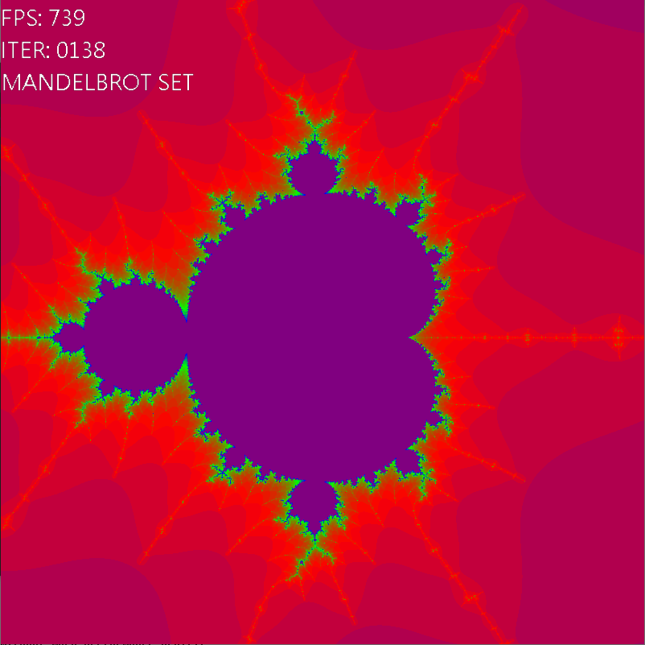
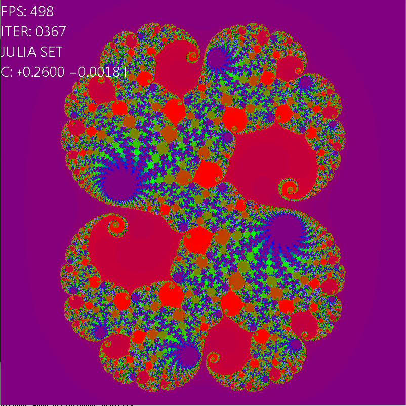
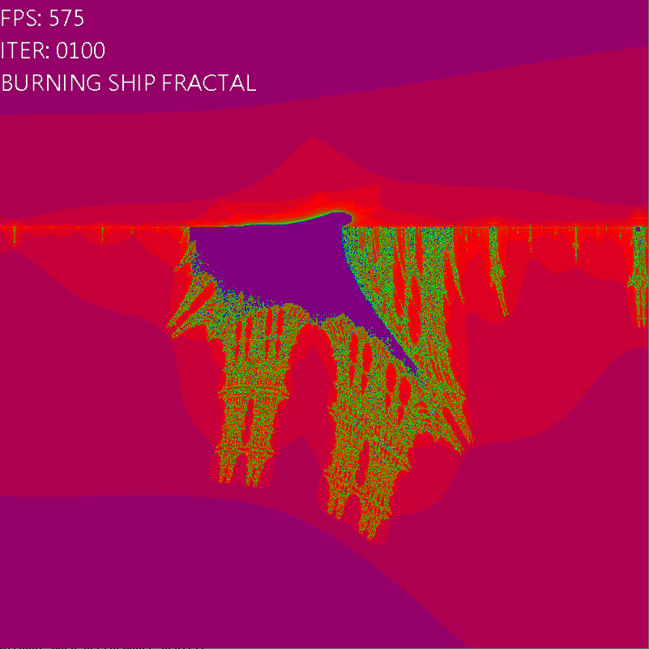

# FRACTAL

This program allows us to explore the,

* Mandelbrot Set
* Julia Set's
* Burning Ship Fractal
* Newton Rhapson Fractals

The Mandelbrot Set and Burning Ship Fractals are normal and as expected.

Julia Set Fractal here can be changed to a certain extent, improving exploration experience.

The Newton Rhapson Fractal is very limited in what it can do, it only allows for the exploration of
one specific equation for reasons that will be explained shortly.

The program can be used to visualize a few of the many fractals that exist which can assist in understanding
of the mathematics behind them.

**Video Link :** https://youtu.be/Rai7Idyv--w

#Images

* 
* 
* 

# How to Use

* The Left Mouse Button can be used to move arround on the fractal.
* The Right Mouse Button lights up the outputs of the funtions at various levels of recursion, with max depth of 10
* Scrolling zooms in or out at the center of the viewport
* <kbd>W</kbd> can be used to increase the number of iterations that occur
* <kbd>S</kbd> can be used to decrease the number of iterations that occur
* <kbd>1</kbd>, <kbd>2</kbd>, <kbd>3</kbd> and <kbd>4</kbd> keys can be used to switch between the fractals, where the number corrospond the the list mentioned at
biginning of the readme.

**Julia Set Specific**
* <kbd>←</kbd> reduces and <kbd>→</kbd> increases the real component of C
* <kbd>↑</kbd> reduces and <kbd>↓</kbd> increases the imaginary component of C
* The imact of both of the above actions can be increased by using the <kbd>Shift</kbd>, <kbd>Ctrl</kbd> and <kbd>Alt</kbd>
modifier keys. The keys are arranged in a ascending order of their 'power'.

# Techinical Details

OpenGL was used to generate and render the fractals. This choise was made to take advantage of the parallelized nature
of the GPU. This however resulted in a limited resolution of the fractal.

A 1D texture was used to send in the colors that are used to render the fractals, this allows for smooth interpolation
of colour.

The Newton Rhapson Fractaal Algorithm is not very well optimized which results in a huge performance hit during computation,
which is why the fractal is kept at a very rudimentary level. But more roots can be added trivially by editing the "fractal.c"
source file.

A Geometry shader was used for Drawing Glowy lines, just to understand how the GPU works a little better.

No Instancing was used to render the font because it was increasing the complexity without much performance benifit.

# Build instructions

Download glfw3 and glad in libs folder then use the make tool to compile.
The program was build on windows with the help w64devkit

*PS: I am on windows so its kind of impossible to create a build script that
will download all the required libraries :( sorry.*

# Acknowledgements

**Resources used to understand the theory behind the fractals:**

* https://en.wikipedia.org/wiki/Julia\_set
* https://en.wikipedia.org/wiki/Burning\_Ship\_fractal
* https://en.wikipedia.org/wiki/Mandelbrot\_set
* https://en.wikipedia.org/wiki/Newton\_fractal

**Resources used to learn graphics programming**

* https://learnopengl.com/

**Libraries Used:**

* GLFW (Cross Platform Windowing Library): https://www.glfw.org/
* GLAD (Opengl v3.3 API Functions): https://glad.dav1d.de/

**Tools Used**

* CBFG (Has been used to generate Bitmap Fonts): http://www.codehead.co.uk/cbfg/
* BFF Font File Format Documentation: https://documentation.help/Codehead-Bitmap-Font-Generator/bffformat.html
